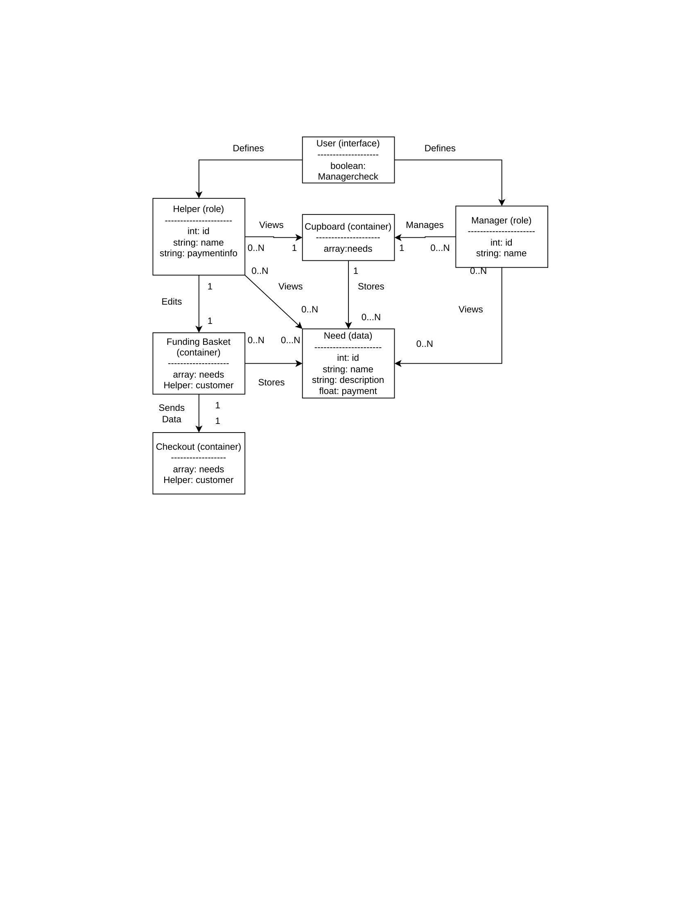
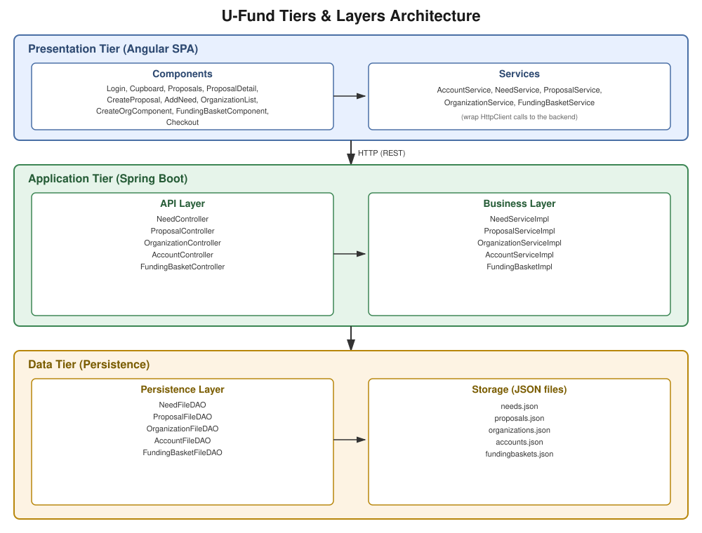
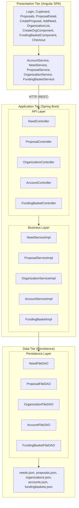
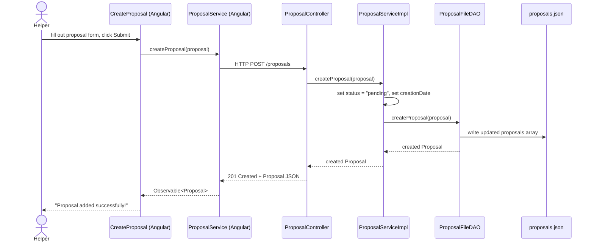
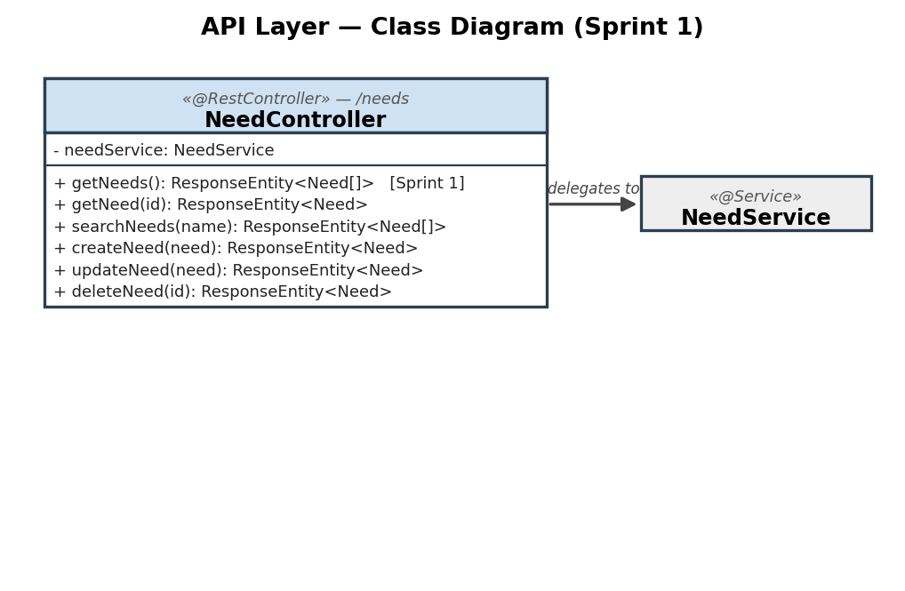
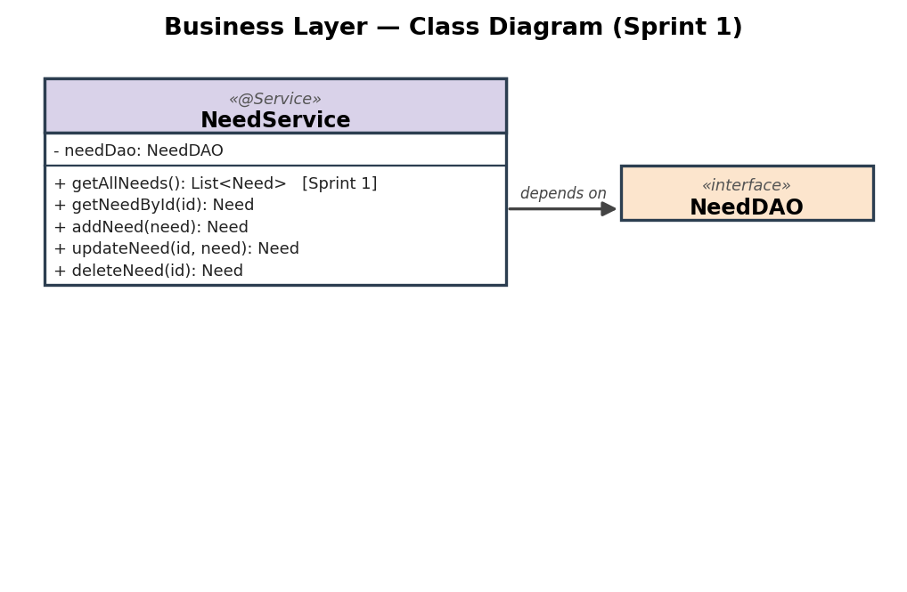
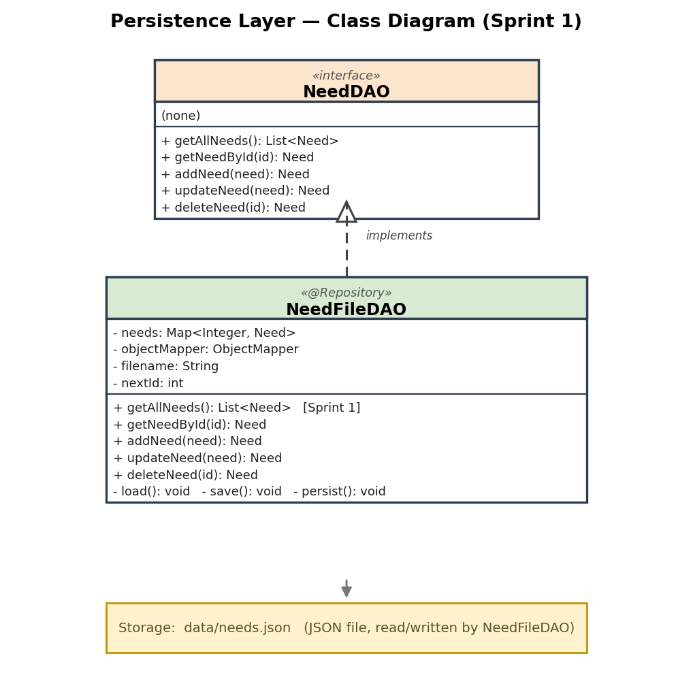

# U-Fund Design Documentation

> _The following template provides the headings for your Design
> Documentation.  As you edit each section make sure you remove these
> commentary 'blockquotes'; the lines that start with a > character
> and appear in the generated PDF in italics but do so only **after** all team members agree that the requirements for that section and current Sprint have been met. **Do not** delete future Sprint expectations._

> _This is now the single, current design document for the project. It
> replaces the separate `DesignDocSprint2.md` and `DesignDocSprint3.md.md`
> files, which described the system's state at those points in time rather
> than its current state. Version control (git history) is the record of how
> the design evolved sprint to sprint — this document should only describe
> the system **as it is right now**._

## Team Information
* Team name: SWEN-261-01-Summer
* Team members
  * Charlie Gorczyca
  * Mouza Alameri
  * Pedrocia De-Sosoo
  * Harikleia Sparakis
  * Victor Omolo
  * Jackson Singley

## Executive Summary

This is a summary of the project.

### Purpose
The UFund project is a nonprofit website for the express purpose of funding the needed resources for animal shelter and rescue operations. Users will either help fund needs by interacting with the website, or manage the needs as an administrator. These users will be those who truly care about helping animals and the organizations who work with them directly.

### Glossary and Acronyms

| Term | Definition |
|------|------------|
| SPA | Single Page Application |
| API | Application Programming Interface |
| DAO | Data Access Object |
| Need | An item the cupboard is collecting (id, name, cost, quantity, type, organization) |
| Cupboard | The full collection of Needs managed by the U-Fund |
| Helper | The user who funds needs and interacts with the project at a surface level |
| Manager | The user who organizes the needs presented to Helpers and oversees the operations on the website |
| Funding Basket | The collection of needs present in a Helper's collection, so they can check out their needs effectively |
| Proposal | A request submitted by a Helper for a new Need, pending Manager approval or rejection |
| Organization | An entity that needs can be affiliated with, managed independently from individual needs |

## Requirements

This section describes the features of the application.

### Definition of MVP

A Minimum Viable Product consists of the following:

-   **Minimal Authentication for Helper/U-fund Manager login & logout**
    -   The server will (admittedly insecurely) trust the browser of who the user is. A simple login is all that is minimally required.
    -   A user (helper or U-fund Manager) can login and logout of the application.
    -   A U-fund Manager logs in using the reserved username **admin**.
    -   Any other username can be assumed to be a helper.

-   **Helper functionality**
    -   Helper can see list of needs
    -   Helper can search for a need
    -   Helper can add/remove a need to their funding basket
    -   Helper can proceed to **check-out** and fund all needs they are supporting

-   **Needs Management**
    -   U-fund Manager(s) can add, remove and edit the data of all their needs stored in their needs cupboard
    -   A U-fund Manager cannot see contents of funding basket(s)

-   **Data Persistence**
    -   The system must save everything to files such that the next user will see a change in the needs cupboard based on the previous user's actions.

### MVP Features

* Account registration, login, and logout, with Manager vs. Helper role separation.
* View the full Cupboard of Needs, with search by name.
* Manager: create, edit, and delete Needs.
* Helper: add/remove a Need to their Funding Basket and check out.
* Data persistence across sessions for all of the above.

### Enhancements

* **Proposals workflow.** Helpers can submit a Proposal for a new Need. Managers can edit, approve, or reject a pending proposal; approving creates a real Need in the Cupboard. Only pending proposals can be approved, rejected, deleted, or edited — once decided, a proposal's status is locked and the delete option is hidden.
* **Voting on proposals.** Helpers can upvote/downvote a pending proposal; voting locks once the proposal is decided.
* **Proposal status and detail views.** A status badge (pending/approved/rejected) is visible everywhere a proposal is listed, plus a dedicated detail page for a single proposal.
* **Organizations.** Managers can create, edit, and delete organizations, and affiliate Needs/Proposals with one. Deleting an organization cascades to remove its associated Needs. An organization's name is locked after creation to avoid breaking the by-name references other records hold to it.
* **Filtering on the Proposals page.** Helpers can filter to just their own proposals ("My Proposals Only"); Managers can hide decided proposals to focus on the pending queue ("Clear Decided"). An active search always overrides both filters so a specific result is never hidden.
* **Signed-in identity in the nav bar.** The nav bar shows who is currently logged in and their account type (Manager/Helper).

## Application Domain

This section describes the application domain.



The central domain entity is the **Need**, which represents a single item the U-Fund cupboard is collecting (e.g. "Dog Food", cost, quantity). These needs are stored in the **Cupboard**, the complete collection of Needs available to view for any user. There are two types of users that can interact with the cupboard, both varying in authorization. The **Manager** (the U-Fund administrator) maintains the cupboard by getting, creating, modifying, and removing Needs through the REST API. The **Helper** interacts with the cupboard by adding needs to their **Funding Basket**, which they use to store needs and eventually send to the **Checkout**. A Helper can also submit a **Proposal** for a new Need, which a Manager reviews and either approves (creating a real Need) or rejects. Needs and Proposals can optionally be affiliated with an **Organization**.

> _TODO (team): recall the guidance on what belongs in a domain diagram vs. what
> doesn't and revise the diagram above accordingly before submitting._

## Architecture and Design

This section describes the application architecture.

### Summary



The diagram above replaces the Sprint 1 placeholder, which only showed a single-tier backend. It reflects the current three-tier architecture across all five domain entities (Need, Proposal, Organization, Account, FundingBasket). The same structure is also expressed below as a Mermaid diagram, which additionally shows the dependency direction between layers:



The web application is built using the **Presentation** (frontend), **Application** (backend), **Data** tiered architecture.

The Presentation (frontend) is a client-side SPA built with Angular, using HTML, CSS, and TypeScript to deliver the user interface and handle all user interactions.

The Application (backend) tier exposes RESTful APIs, implements business logic, and uses repositories/DAOs to interact with the underlying Data tier for persistence.

The Data tier contains the mechanisms responsible for storing, retrieving, and managing the application's data using low-level storage systems (JSON files).

Both the Application and Data tiers are implemented using Java and the Spring Framework, with details of their internal components provided below.

### Overview of User Interface

This section describes the web interface and flow; this is how the user views and interacts with the web application.

> _TODO (team): replace with representative screenshots of the current
> high-fidelity UI._

Every user lands on **Login**. Once authenticated, the nav bar shows who's signed in and their role, and the routes available differ by role via route guards (`authGuard`, `managerGuard`, `helperGuard`). From there:


* **Any logged-in user** can browse the **Cupboard** (search/filter Needs) and the **Proposals** list (search/filter/sort, with a status badge per proposal), and open a proposal's **Detail** page.
  

* **Helpers** additionally see "Propose a New Need" (submits a Proposal), can vote on pending proposals, can add Needs to their **Funding Basket** and proceed through **Checkout**, and can filter the Proposals list to just their own submissions.
  

* **Managers** additionally see "Add Need" and the **Organizations** list (create/edit/delete an organization, view its affiliated Needs), and on the Proposals page can edit/approve/reject/delete a pending proposal, or hide decided proposals to focus on the pending queue.


`unsavedChangesGuard`/`unsavedProposalGuard` warn the user before navigating away from an in-progress edit.

### Presentation Tier

The Presentation tier is the Angular SPA. It's organized as one component per page/concern (e.g. `Login`, `Cupboard`, `AddNeed`, `Proposals`, `ProposalDetail`, `CreateProposal`, `OrganizationList`, `CreateOrgComponent`, `FundingBasketComponent`, `Checkout`), each paired with an injectable Angular service (`AccountService`, `NeedService`, `ProposalService`, `OrganizationService`, `FundingBasketService`) that wraps `HttpClient` calls to the backend API. Components hold only view state and delegate all data access to their service, mirroring the Controller/Service split used on the backend. Route guards gate navigation by auth/role before a component is even loaded, and `canDeactivate` guards on the edit-heavy components (proposal/need/org editing) prevent silently losing unsaved changes.

Below are two sequence diagrams covering a full round trip from the client through the backend to storage.

**Sequence 1 — Helper submits a proposal:**



**Sequence 2 — Manager approves a proposal:**

```mermaid
sequenceDiagram
    actor Manager
    participant UI as Proposals (Angular)
    participant PS as ProposalService (Angular)
    participant PC as ProposalController
    participant PSvc as ProposalServiceImpl
    participant NSvc as NeedServiceImpl
    participant OSvc as OrganizationServiceImpl
    participant NFile as needs.json
    participant OFile as organizations.json

    Manager->>UI: click Approve on a pending proposal
    UI->>PS: approveProposal(id)
    PS->>PC: HTTP POST /proposals/{id}/approve
    PC->>PSvc: approveProposal(id)
    PSvc->>PSvc: validate status is "pending", validate type
    PSvc->>NSvc: createNeed(need)
    NSvc->>OSvc: getOrganization(name)
    alt organization exists (or none was specified)
        OSvc-->>NSvc: Organization
        NSvc->>NFile: write new Need
        NSvc->>OSvc: addNeed(org, need)
        OSvc->>OFile: write updated Organization
        NSvc-->>PSvc: created Need
        PSvc->>PSvc: set proposal status = "approved"
        PSvc-->>PC: updated Proposal
        PC-->>PS: 200 OK + Proposal JSON
        PS-->>UI: Observable<Proposal>
        UI-->>Manager: "Need approved and added to the cupboard"
    else organization name doesn't match any existing organization
        OSvc-->>NSvc: null
        NSvc-->>PSvc: throws IllegalArgumentException
        PSvc-->>PC: exception propagates (proposal left "pending")
        PC-->>PS: 400 Bad Request + error message
        PS-->>UI: Observable error
        UI-->>Manager: "Organization X does not exist; fix the spelling before approving"
    end
```

### Application Tier

The Application tier is the Spring Boot backend. It receives HTTP requests from the Angular client, applies business logic, and coordinates with the Data tier for persistence. It is organized into two layers: the **API Layer** (REST controllers) and the **Business Layer** (services).

#### API Layer

The API Layer exposes the RESTful endpoints of the application. It is responsible only for HTTP concerns — mapping routes, reading request bodies/parameters, and translating business results into `ResponseEntity` responses with the correct HTTP status code. It delegates all logic to the Business Layer.

Classes supporting this layer:

* **`NeedController`** — REST controller mapped to the `/needs` route, providing full CRUD for Needs.
* **`FundingBasketController`** — REST controller mapped to the `/fundingbaskets` route, retrieving, creating, and deleting FundingBaskets, and adding/removing Needs via `addNeed()`/`removeNeed()`.
* **`AccountController`** — REST controller mapped to the `/accounts` route, orchestrating registration, login, and logout.
* **`OrganizationController`** — REST controller mapped to the `/organization` route, handling create/update/delete of organizations and adding/removing needs from them.
* **`ProposalController`** — REST controller handling CRUD for proposals, plus approving/rejecting proposals and recording votes.



#### Business Layer

The Business Layer contains the application's business logic. It sits between the API Layer and the Persistence Layer so that controllers never talk to DAOs directly. This keeps business rules in one place and makes the controllers thin.

Classes supporting this layer:

* **`NeedService`** — implements Need operations (CRUD), including keeping a Need's Organization link in sync when a Need is created, edited, or deleted.
* **`FundingBasketService`** — implements FundingBasket operations and checkout logic.
* **`AccountService`** — implements Account operations, including username validation.
* **`OrganizationService`** — implements Organization CRUD.
* **`ProposalService`** — implements Proposal CRUD, plus approve/reject/vote business rules (e.g. only pending proposals can be approved, rejected, deleted, or voted on).



#### Persistence Layer

The Persistence Layer is responsible for storing and retrieving domain objects. It hides the storage mechanism behind an interface so the rest of the application is independent of how data is actually persisted.

Classes supporting this layer:

* **`NeedDAO`** / **`NeedFileDAO`** — persists Needs to `data/needs.json`.
* **`FundingBasketDAO`** / **`FundingBasketFileDAO`** — persists FundingBaskets to `data/fundingbaskets.json`.
* **`AccountDAO`** / **`AccountFileDAO`** — persists Accounts to `data/accounts.json`.
* **`OrganizationDAO`** / **`OrganizationFileDAO`** — persists Organizations to `data/organizations.json`.
* **`ProposalDAO`** / **`ProposalFileDAO`** — persists Proposals to `data/proposals.json`.

Each `*FileDAO` uses a Jackson `ObjectMapper` and loads its file into an in-memory `Map` on startup; reads are served from the cache, and writes are saved back to disk.



### Data Tier

The Data tier is the actual storage mechanism: JSON files under `data/`, one per domain entity (`needs.json`, `accounts.json`, `fundingbaskets.json`, `organizations.json`, `proposals.json`), each configured via `application.properties`. The corresponding `*FileDAO` is the only component that reads or writes its file, keeping the storage format isolated from the rest of the system.

## Design Principles Analysis

This section documents four OO design principles, each demonstrated on **both** the frontend (Presentation tier) and backend (Application/Data tiers), per the Sprint 4 rubric. See the API/Business/Persistence Layer class diagrams and the architecture diagram in the Architecture and Design section above for the supporting structure referenced below.

-   **Controller**
    -   *Backend:* the Controller principle assigns responsibility for receiving and coordinating a system operation to a class outside the business logic itself. Each REST controller owns one resource's HTTP handling — e.g. `ProposalController.rejectProposal()` verifies the caller is a manager and returns the appropriate HTTP status, but does not implement the rejection rule itself; that's delegated to `ProposalServiceImpl`.
    -   *Frontend:* Angular components play the same coordinating role for the UI. `Proposals` (the component) receives the user's click on "Approve," but doesn't know how approval works — it calls `ProposalService.approveProposal(id)` and reacts to the result. The component coordinates the interaction; it doesn't implement the business rule.
    -   This keeps both the REST controllers and the Angular components focused only on receiving/coordinating an action and reporting the outcome, not deciding how the action itself works.

-   **Single Responsibility**
    -   *Backend:* each class has one reason to change — `AccountServiceImpl` handles only account validation, `FundingBasketImpl` exclusively manages basket operations, `NeedServiceImpl` handles need creation/update and delegates persistence to `NeedDAO`.
    -   *Frontend:* the same split exists per component and per service. `CreateProposal` only handles the proposal submission form; it doesn't know how to render the proposals list or handle voting — that's `Proposals`' job. Each Angular service is scoped to one domain entity (`ProposalService` only makes proposal-related HTTP calls, `OrganizationService` only organization-related calls), so a component never has to reach into an unrelated service to get its data.

-   **Low Coupling**
    -   *Backend:* the layered Controller → Service → DAO architecture keeps each layer's responsibility focused without depending on another layer's internals. The Service layer checks for invalid states and returns clear errors (e.g. rejecting an already-decided proposal) rather than letting failures propagate as unhandled exceptions the Controller has to interpret.
    -   *Frontend:* components never call `HttpClient` directly — always through an injected service. If a backend endpoint's URL or request shape changes, only the corresponding Angular service needs to change; every component using it is unaffected. This mirrors exactly why the backend never lets a controller talk to a DAO directly.

-   **Dependency Injection**
    -   *Backend:* high-level classes depend on abstractions Spring supplies at runtime — `NeedController` depends on `NeedService`, not a concrete implementation.
    -   *Frontend:* the identical pattern exists in Angular. Every component declares its dependencies (`ProposalService`, `AccountService`, `Router`, etc.) as constructor parameters rather than constructing them itself; Angular's injector supplies the instances. This is what makes each Angular service a single shared source of truth (e.g. `AccountService` holding the current logged-in account) instead of every component managing its own copy of that state.

**Improvements made in response to Sprint 3 feedback:** two issues flagged in the previous review directly undermined how well these principles could be demonstrated, and both are fixed in this submission. The architecture diagram was outdated and didn't reflect the current layered structure that the Controller/Low Coupling principles above rely on — it's been replaced with a diagram showing all five current domain entities across all three tiers. The previously reported unit test coverage number (55%) didn't match the actual JaCoCo report (93%/82%) — the corrected, verified numbers are now used throughout, which matters here because test coverage is direct evidence that the Single Responsibility boundaries between layers actually hold up under testing.

## Static Code Analysis

> _TODO (team): this section needs real SonarQube findings, not test coverage
> numbers (coverage belongs under Unit Testing and Code Coverage below, and
> is already filled in there). Per the Static Code Analysis Exercise: run
> `mvn clean test sonar:sonar -Dsonar.token=<token>` against the backend and
> SonarScanner against the Angular frontend, then from the SonarQube "Issues"
> view, identify 3-4 flagged areas — pick from whatever mix of severity
> (major/critical/blocker) and type (bug/vulnerability/code smell) actually
> shows up, plus anything flagged for Cognitive Complexity — with a
> screenshot of each. This can't be filled in remotely since SonarQube runs
> against `localhost:9000` on whoever's machine ran the scan._

## Recommendations for Improvement

1. **Proposal edit auto-approves on save.** Saving an edited proposal as a manager currently also approves it in the same action, so a manager can't correct a typo or bad data without immediately approving the request — this breaks the Single Responsibility separation between "editing" and "deciding" that the rest of the proposal workflow follows. *Recommendation:* decouple "save" from "approve" into two distinct actions.
2. **Organization identified by name, not a stable ID.** Every reference to an organization (from Needs and Proposals) is by name, so an organization's name currently cannot be changed without breaking those references — it's locked as read-only after creation as a stopgap, which is a usability regression for managers. *Recommendation:* give Organization a stable identifier independent of its display name, consistent with how every other entity (Need, Proposal, Account) is already keyed by ID rather than a mutable field.
3. **Need types don't meaningfully differ in structure.** The different Need types share one generic shape with no type-specific fields or behavior, which weakens the Single Responsibility of the `Need` model. *Recommendation:* revisit whether type-specific fields/behavior (or a small type hierarchy) would better represent the differences between item donations, monetary needs, and volunteering needs.
4. **Service-layer branch coverage.** Directly tied to the coverage data under Unit Testing and Code Coverage below: the newer validation/guard logic in the service layer is the least-covered area in the codebase. *Recommendation:* prioritize tests for the exception paths (invalid organization, already-decided proposal, duplicate need name) before further feature work.
5. _TODO (team): add 1-2 more recommendations once the real SonarQube findings above are in, tied to whatever it actually flags._

**Process improvements already made this sprint, worth continuing:** this sprint's work moved to feature branches with pull requests instead of direct commits to `main` (a specific issue called out in review), and reduced backend crashes caused by unhandled null/edge cases surfacing as raw 500 errors instead of clear messages — both are architecture/design-principle wins (Low Coupling, clear layer responsibilities) as much as they are process wins.

## Testing

### Acceptance Testing

Per the team's Acceptance Test Plan, all 33 user stories (108 individual acceptance criteria across them) currently pass, with no known failing or untested criteria as of the most recent recorded test pass (7/27). This covers the full MVP plus enhancements: authentication, cupboard search/filter, funding basket and checkout, needs management, organizations (view/create/edit/delete, need affiliation), and the proposals workflow (create, view/search/sort, status, votes, approve/reject).

In addition, the following were manually re-verified end-to-end this sprint after being fixed, ahead of the next formal test pass: proposal submission, edit, approve, reject, and delete (each correctly restricted to pending-only where applicable); voting and vote-locking on decided proposals; organization create/edit/delete with cascading need removal; need create/edit/delete including organization sync; and the Proposals page filters (My Proposals Only, Clear Decided, and search overriding both).

### Unit Testing and Code Coverage

Unit tests are written per layer using JUnit 5 and Mockito, covering controllers, services, and DAOs. Current coverage per the JaCoCo report: **93% instruction coverage** (285 of 4,426 instructions missed) and **82% branch coverage** (62 of 364 branches missed), broken down by package:

| Package | Instruction Cov. | Branch Cov. |
|---|---|---|
| `service` | 82% | 72% |
| `controller` | 94% | 88% |
| `dao` | 98% | 84% |
| `model` | 96% | 80% |
| `ufundapi` (root/`Application` bootstrap class) | 0% | n/a |
| **Total** | **93%** | **82%** |


**Missed-target area:** the service layer is the clear outlier at 82%/72%, well below every other package. This is consistent with the newer guard-clause logic added this sprint — status checks on approve/reject/vote/delete, organization-existence validation, and null-checks for missing organizations. These conditional branches (the "if it doesn't exist, throw" paths) are the direct cause of the 72% branch number and are the highest-priority target for new unit tests.

**Outlier explained, not a gap:** the `ufundapi` root package shows 0%, but that's only the Spring Boot `Application` bootstrap class, which has no logic to test — it's not a real coverage gap, just a single trivial class dragging that one row down.

**Before/after correction:** last sprint's design doc reported 55% coverage, which didn't match the actual JaCoCo report at the time (93%/82%) — that was a transcription error, not a real regression. This submission uses the verified numbers pulled directly from the report above.

## Ongoing Rationale

* **(2026/06/15): Sprint 1** — Adopted a three-layer backend architecture (Controller → Service → DAO). Justification: improves separation of concerns and testability, and supports Dependency Inversion.
* **(2026/06/15): Sprint 1** — Implemented the *Get Entire Cupboard* story end-to-end (`GET /needs`) and introduced `NeedFileDAO`, a JSON-file-backed persistence implementation.
* **(2026/07/06): Sprint 2** — Implemented basic frontend functionality (Cupboard, FundingBasket, Login pages, AddNeed) to standardize the Angular version/build in use and avoid conflicts.
* **(2026/07/07): Sprint 2** — Reworked frontend logic ahead of the demo and to close gaps found during acceptance testing.
* **(2026/07/2X): Sprint 3** — Introduced the Organization and Proposal domain entities and their full CRUD/approve/reject/vote workflow, including `OrganizationController`/`OrganizationService`/`OrganizationFileDAO` and `ProposalController`/`ProposalService`/`ProposalFileDAO`. Justification: needed to support Helper-submitted proposals and Manager-managed organizations as first-class parts of the domain, per the sprint's user stories.
* **(2026/07/29): Sprint 4** — Kept `Proposal.type` as a `String` rather than a `NeedType` enum. Justification: Jackson throws and crashes the entire load if any stored value doesn't exactly match an enum constant; keeping it a `String` allows graceful validation with a clear error at approval time instead of taking down the whole endpoint on legacy/bad data.
* **(2026/07/29): Sprint 4** — Added pending-status guards to proposal approve, reject, delete, and vote actions, so a decided proposal can no longer be re-approved/re-rejected, deleted, or voted on. Justification: prevented duplicate Need creation and confusing status bouncing found during manual testing.
* **(2026/07/29): Sprint 4** — Removed the rule that deleting a Need automatically reverted its originating proposal's status to "rejected." Justification: approval is a historical fact about a decision already made; deleting the resulting Need later (fully funded, discontinued, duplicate) is a separate inventory action and shouldn't be recorded as if the manager had declined the original request.
