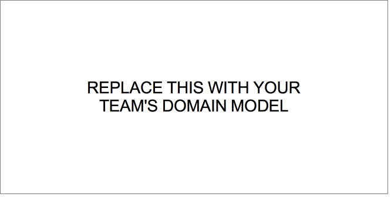
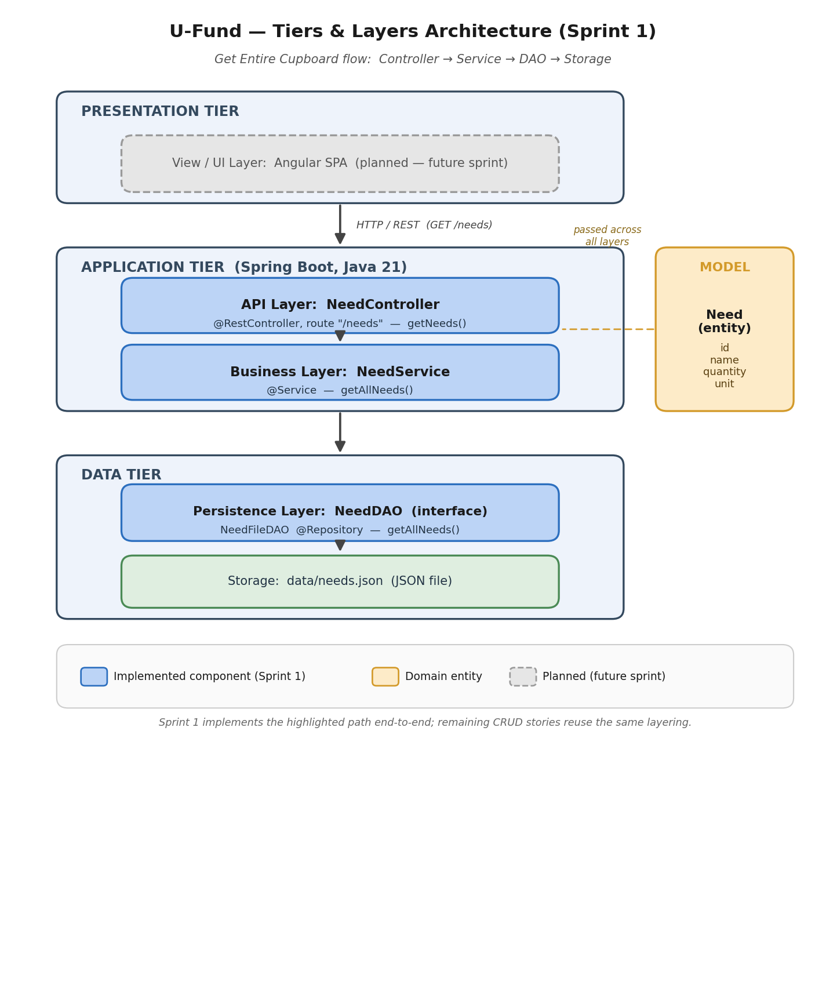
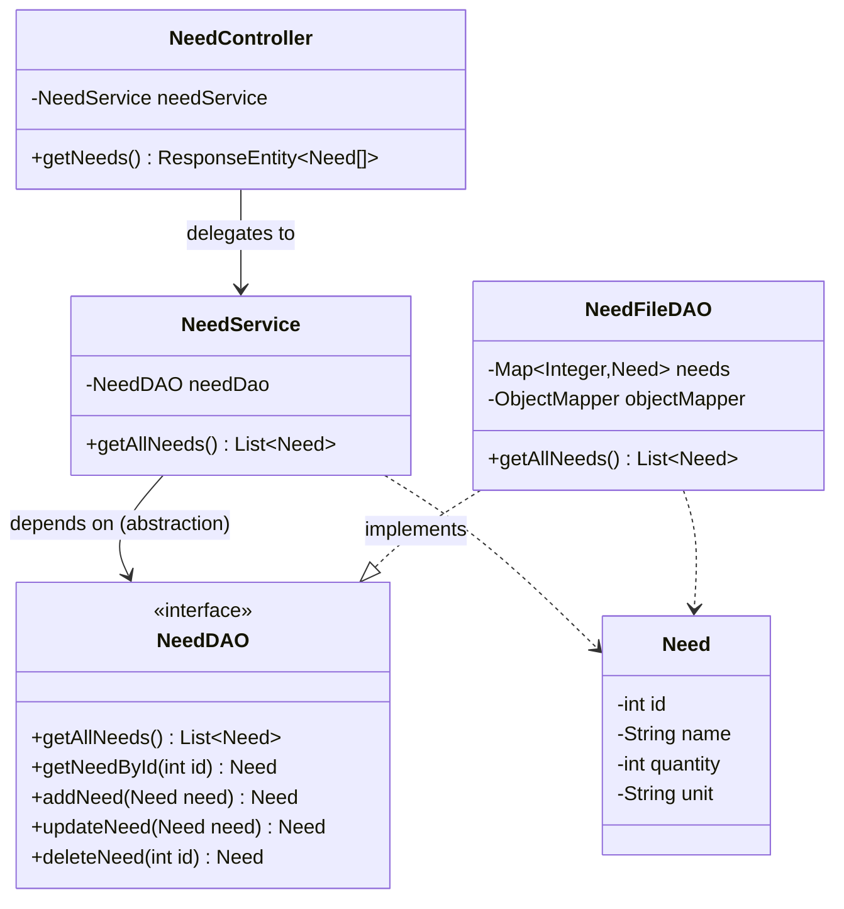
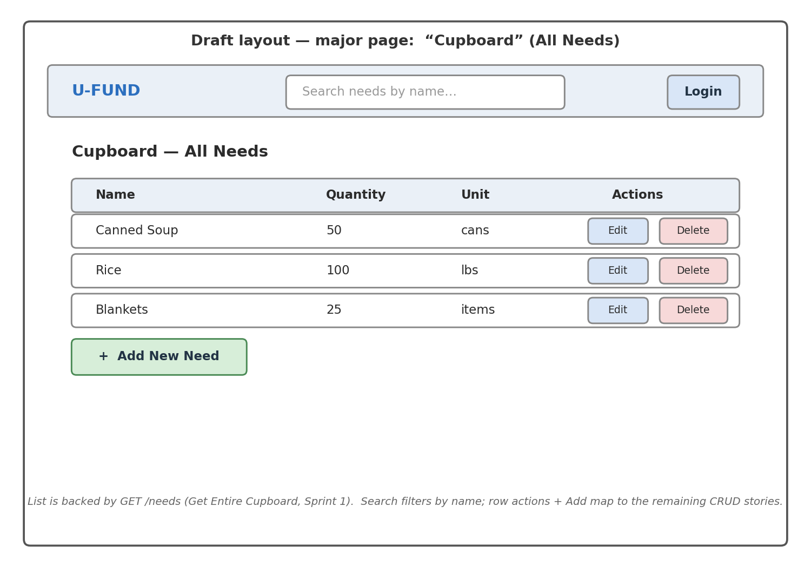

# PROJECT Design Documentation

> _The following template provides the headings for your Design
> Documentation.  As you edit each section make sure you remove these
> commentary 'blockquotes'; the lines that start with a > character
> and appear in the generated PDF in italics but do so only **after** all team members agree that the requirements for that section and current Sprint have been met. **Do not** delete future Sprint expectations._

## Team Information
* Team name: _TODO: confirm official team name_
* Team members
  * Sarah Gorczyca
  * Mouza Alameri
  * Pedrocia De-Sosoo
  * Harikleia Sparakis
  * Victor Omolo
  * Jackson Singley

## Executive Summary

This is a summary of the project.

### Purpose
>  _**[Sprint 2 & 4]** Provide a very brief statement about the project and the most
> important user group and user goals._

### Glossary and Acronyms
> _**[Sprint 2 & 4]** Provide a table of terms and acronyms._

| Term | Definition |
|------|------------|
| SPA | Single Page Application |
| API | Application Programming Interface |
| DAO | Data Access Object |
| Need | An item the cupboard is collecting (id, name, quantity, unit) |
| Cupboard | The full collection of Needs managed by the U-Fund |


## Requirements

This section describes the features of the application.

> _In this section you do not need to be exhaustive and list every
> story.  Focus on top-level features from the Vision document and
> maybe Epics and critical Stories._

### Definition of MVP
> _**[Sprint 2 & 4]** Provide a simple description of the Minimum Viable Product._

### MVP Features
>  _**[Sprint 4]** Provide a list of top-level Epics and/or Stories of the MVP._

### Enhancements
> _**[Sprint 4]** Describe what enhancements you have implemented for the project._


## Application Domain

This section describes the application domain.



> _**[Sprint 2 & 4]** Provide a high-level overview of the domain for this application. You
> can discuss the more important domain entities and their relationship
> to each other._

The central domain entity for Sprint 1 is the **Need**, which represents a single
item the U-Fund cupboard is collecting (e.g. "Canned Soup", quantity 50, unit
"cans"). The **Cupboard** is the complete collection of Needs. A **Manager** (the
U-Fund administrator) maintains the cupboard by getting, creating, modifying, and
removing Needs through the REST API.


## Architecture and Design

This section describes the application architecture.

### Summary

The following Tiers/Layers diagram shows a high-level view of the webapp's architecture. 
**NOTE**: detailed diagrams are required in later sections of this document.
> _**[Sprint 1]** (Augment this diagram with your **own** rendition and representations of sample system classes, placing them into the appropriate Component box (blue rectangle) inside the corresponding Layer. Focus on what is currently required to support **Sprint 1 - Demo requirements**. Make sure to describe your design choices in the corresponding _**Tier Section**_ and also in the _**OO Design Principles**_ section below.)_



The web application is built using the **Presentation**(frontend), **Application**(backend), **Data** tiered architecture. 

The Presentation (frontend) is a client‑side SPA built with Angular, using HTML, CSS, and TypeScript to deliver the user interface and handle all user interactions.

The Application (backend) tier exposes RESTful APIs, implements business logic, and uses repositories/DAOs to interact with the underlying Data tier for persistence.

The Data contains the mechanisms responsible for storing, retrieving, and managing the application’s data using low‑level storage systems.

Both the Application and Data tiers are implemented using Java and the Spring Framework, with details of their internal components provided below.

#### Sprint 1 Component Placement

The diagram below shows where the **Sprint 1** classes live within the tiers and
layers. (The Presentation tier is planned for a later sprint and is not yet
implemented.) Replace the placeholder image above with a rendition that contains
these same components inside their Layer boxes.

```
Presentation Tier  (frontend — planned, not yet implemented)
    └─ Angular SPA  ............  (future sprint)

Application Tier   (backend — Java / Spring Boot)
    ├─ API Layer ............... NeedController   (@RestController, route "/needs")
    └─ Business Layer .......... NeedService      (@Service)

Data Tier          (persistence — Java / Spring Boot)
    ├─ Persistence Layer ....... NeedDAO          (interface — persistence contract)
    │                            NeedFileDAO      (@Repository — JSON-file implementation)
    └─ Storage ................. data/needs.json  (JSON data file)

Model / Entity (shared, passed across all layers): Need (id, name, quantity, unit)
```

**Request flow for the _Get Entire Cupboard_ story** (implemented in Sprint 1):

```
HTTP GET /needs
   → NeedController.getNeeds()      (API Layer: handles the HTTP request/response)
   → NeedService.getAllNeeds()      (Business Layer: applies business logic)
   → NeedFileDAO.getAllNeeds()      (Persistence Layer: reads the in-memory cache)
   → controller converts the List<Need> to a Need[] → serialized to a JSON array with HTTP 200
```

The same class structure rendered as a UML class diagram (renders on GitHub):




### Overview of User Interface

This section describes the web interface and flow; this is how the user views and interacts with the web application.
>_For the reference below, provide an initial draft image/sketch of possible layout of a major page of your User Interface and a brief description of the elements it contains **[Sprint 1]**_



> _**[Sprint 1]** The draft wireframe above (`draft-layout-ui.png`) shows the intended
> layout of the major "Cupboard" page. The textual version below documents the same
> elements for reference._

Draft layout of the major page (the **Cupboard** page):

```
+--------------------------------------------------------------+
|  U-FUND               [ Search needs... ]        [ Login ]   |
+--------------------------------------------------------------+
|  Cupboard — All Needs                                        |
|  +--------------------------------------------------------+  |
|  | Name          | Quantity | Unit   | Actions            |  |
|  |---------------|----------|--------|--------------------|  |
|  | Canned Soup   |   50     | cans   | [Edit] [Delete]    |  |
|  | Rice          |  100     | lbs    | [Edit] [Delete]    |  |
|  | Blankets      |   25     | items  | [Edit] [Delete]    |  |
|  +--------------------------------------------------------+  |
|  [ + Add New Need ]                                          |
+--------------------------------------------------------------+
```

The major page lists every Need in the cupboard (backed by `GET /needs`, the story
delivered in Sprint 1). A search box filters needs by name, and per-row actions plus
an "Add New Need" button map onto the remaining CRUD stories.

### 
> _Provide a summary of the application's user interface.  Describe, from the user's perspective, the flow of the pages/navigation in the web application.
>  (Add low-fidelity mockups prior to initiating your **[Sprint 2]**  work so you have a good idea of the user interactions.) Eventually replace with representative screenshots of your high-fidelity results as these become available and finally include future recommendations improvement recommendations for your **[Sprint 4]** )_


### Presentation Tier
> _**[Sprint 4]** Provide a summary of the Presentation Tier UI of your architecture.
> Describe the types of components in the tier and describe their
> responsibilities.  This should be a narrative description, i.e. it has
> a flow or "story line" that the reader can follow._

> _**[Sprint 4]** You must  provide at least **2 sequence diagrams** as is relevant to a particular aspects 
> of the design that you are describing.  (**For example**, in a shopping experience application you might create a 
> sequence diagram of a customer searching for an item and adding to their cart.)
> As these can span multiple tiers, be sure to include the round-trip, starting at an HTTP request from the client-side (frontend), covering steps through the server-side (backend) and reaching data storage
> to help illustrate the end-to-end flow._

### Application Tier
> _**[Sprint 4]** Provide a summary of this tier of your architecture. This
> section will follow the same instructions that are given for the Presentation
> Tier above._

The Application tier is the Spring Boot backend. It receives HTTP requests from the
(future) Angular client, applies business logic, and coordinates with the Data tier
for persistence. It is organized into two layers: the **API Layer** (REST
controllers) and the **Business Layer** (services).

#### API Layer
> _**[Sprint 1, 4]** Provide a summary of this architectural layer._
>
> _**[Sprint 1, 2, 3]** List the classes supporting this layer and provide a brief description of their purpose._

The API Layer exposes the RESTful endpoints of the application. It is responsible
only for HTTP concerns — mapping routes, reading request bodies/parameters, and
translating business results into `ResponseEntity` responses with the correct HTTP
status code. It delegates all logic to the Business Layer.

Classes supporting this layer:

* **`NeedController`** — REST controller mapped to the `/needs` route. In Sprint 1 it
  implements `getNeeds()` (the *Get Entire Cupboard* story), which returns the full
  array of Needs with status `200 OK` (an empty array when the cupboard is empty).
  The remaining CRUD endpoints (get-by-id, search, create, update, delete) are
  declared and owned by other team members.

> _At appropriate places as part of this narrative provide **one** or more updated and **properly labeled**
> static models (UML class diagrams). See the class diagram in the **Summary** section above for the Sprint 1 API/Business/Persistence relationships._


#### Business Layer
> _**[Sprint 1, 4]** Provide a summary of this architectural layer._
>
> _**[Sprint 1, 2, 3]** List the classes supporting this layer and provide a brief description of their purpose._

The Business Layer contains the application's business logic. It sits between the API
Layer and the Persistence Layer so that controllers never talk to DAOs directly. This
keeps business rules in one place and makes the controllers thin.

Classes supporting this layer:

* **`NeedService`** — Spring `@Service` that implements the Need operations. For
  Sprint 1, `getAllNeeds()` retrieves the entire cupboard from the DAO. It also
  provides the supporting CRUD operations used by the other Sprint 1 stories.


#### Persistence Layer
> _**[Sprint 1, 4]** Provide a summary of this architectural layer._
>
> _**[Sprint 1, 2, 3]** List the classes supporting this layer and provide a brief description of their purpose._

The Persistence Layer is responsible for storing and retrieving Needs. It hides the
storage mechanism behind an interface so the rest of the application is independent of
how data is actually persisted.

Classes supporting this layer:

* **`NeedDAO`** — interface defining the persistence contract
  (`getAllNeeds`, `getNeedById`, `addNeed`, `updateNeed`, `deleteNeed`).
* **`NeedFileDAO`** — `@Repository` implementation that persists Needs to a JSON file
  (`data/needs.json`) using a Jackson `ObjectMapper`. On startup it loads the file
  into an in-memory `Map` cache; reads (such as `getAllNeeds()`) are served from the
  cache, and writes are saved back to disk.


### Data Tier
> _**[Sprint 1, 4]** Provide a summary of this tier of your architecture. This
> section will follow the same instructions that are given for the Presentation
> Tier above._

The Data tier is the actual storage mechanism. In Sprint 1 the data is stored as a
JSON document, `data/needs.json`, whose location is configured by the `needs.file`
property in `application.properties`. The file holds a JSON array of Need objects.
The Persistence Layer (`NeedFileDAO`) is the only component that reads or writes this
file, keeping the storage format isolated from the rest of the system.

## OO Design Principles

> _**[Sprint 1]** Name and describe the initial OO Principles that your team has considered in support of your design (and implementation) for this first Sprint._

For Sprint 1 the team applied the following object-oriented design principles:

* **Dependency Inversion / Dependency Injection (Spring).** High-level classes depend
  on abstractions, not concrete implementations: `NeedController` depends on
  `NeedService`, and `NeedService` depends on the **`NeedDAO` interface** rather than
  the concrete `NeedFileDAO`. Spring injects the concrete implementations at runtime.
  This lets us swap the persistence mechanism later (e.g. a database DAO) without
  touching the controller or service, and it lets us unit-test each layer in
  isolation by injecting Mockito mocks.

* **Single Responsibility / Separation of Concerns.** Each class has exactly one
  reason to change: `NeedController` handles only HTTP concerns, `NeedService` holds
  only business logic, `NeedFileDAO` handles only persistence, and `Need` is a plain
  data entity. This keeps each class small, cohesive, and easy to test.

* **Low Coupling / High Cohesion (layered architecture).** The strict
  Controller → Service → DAO layering means a change in one layer has minimal impact
  on the others. Controllers never reach past the service into the DAO, so coupling
  between the API and Persistence layers stays low while each layer remains highly
  cohesive.

> _**[Sprint 2, 3 & 4]** Will eventually address up to **4 key OO Principles** in your final design. Follow guidance in augmenting those completed in previous Sprints as indicated to you by instructor. Be sure to include any diagrams (or clearly refer to ones elsewhere in your Tier sections above) to support your claims._

> _**[Sprint 3 & 4]** OO Design Principles should span across **all tiers.**_

## Static Code Analysis/Future Design Improvements
> _**[Sprint 4]** With the results from the Static Code Analysis exercise, 
> **Identify 3-4** areas within your code that have been flagged by the Static Code 
> Analysis Tool (SonarQube) and provide your analysis and recommendations.  
> Include any relevant screenshot(s) with each area._

> _**[Sprint 4]** Discuss **future** refactoring and other design improvements your team would explore if the team had additional time._

## Testing
> _This section will provide information about the testing performed
> and the results of the testing._

### Acceptance Testing
> _**[Sprint 2 & 4]** Report on the number of user stories that have passed all their
> acceptance criteria tests, the number that have some acceptance
> criteria tests failing, and the number of user stories that
> have not had any testing yet. Highlight the issues found during
> acceptance testing and if there are any concerns._

### Unit Testing and Code Coverage
> _**[Sprint 4]** Discuss your unit testing strategy. Report on the code coverage
> achieved from unit testing of the code base. Discuss the team's
> coverage targets, why you selected those values, and how well your
> code coverage met your targets._

> _**[Sprint 2, 3 & 4]** **Include images of your code coverage report.** If there are any anomalies, discuss
> those._

**Sprint 1 status (current):** Unit tests are written per layer using JUnit 5 and
Mockito — `NeedControllerTest` (API), `NeedServiceTest` (Business), and
`NeedFileDAOTest` (Persistence) — covering both acceptance criteria of the
*Get Entire Cupboard* story (full list → 200, empty cupboard → empty array → 200).
All unit tests pass (`mvn test` → BUILD SUCCESS).

**Manual / acceptance check:** running the app (`mvn spring-boot:run`) and calling
`GET http://localhost:8080/needs` returns the seeded needs as a JSON array with
HTTP 200; emptying `data/needs.json` returns `[]` with HTTP 200 — both acceptance
criteria confirmed at the live HTTP boundary.

## Ongoing Rationale
>_**[Sprint 1, 2, 3 & 4]** Throughout the project, provide a time stamp **(yyyy/mm/dd): Sprint # and description** of any _**major**_ team decisions or design milestones/changes and corresponding justification._

* **(2026/06/15): Sprint 1** — Adopted a three-layer backend architecture
  (Controller → Service → DAO). Added a `NeedService` business layer between the
  controller and the DAO so business logic is centralized and controllers stay thin.
  Justification: improves separation of concerns and testability, and supports the
  Dependency Inversion principle.
* **(2026/06/15): Sprint 1** — Implemented the *Get Entire Cupboard* story end-to-end
  (`GET /needs`) and introduced `NeedFileDAO`, a JSON-file-backed persistence
  implementation, so the application can actually start and serve data.
